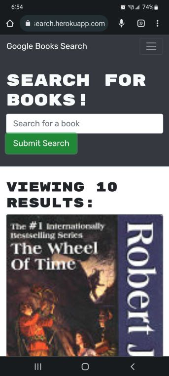

# Google Book Search

This is a simple book search app that allows a user to create an profile, login and save or delete books to a list. 

## What I've done

The app was already a fully functioning Google Books API search engine built with a RESTful API I have refactored it to be a GraphQL API built with Apollo Server. The app was built using the MERN stack, with a React front end, MongoDB database, and Node.js/Express.js server and API. 

## Deployed app

You can find and use the app at https://andrearene-google-book-search.herokuapp.com/

# A look at the app

## App at mobile size:

